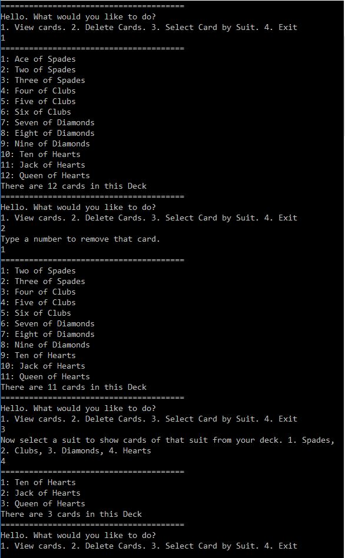

# lab07-collections
This is a console app built in C# to demonstrate the usability of Enumerators and Generic types & Collections. This concept is displayed here using a deck of cards as an example.

## Visual

## How to use
1. Clone this repo
2. Open Collections.sln file in Visual Studio
3. Run application (console window will open)
4. Follow directions on console screen
